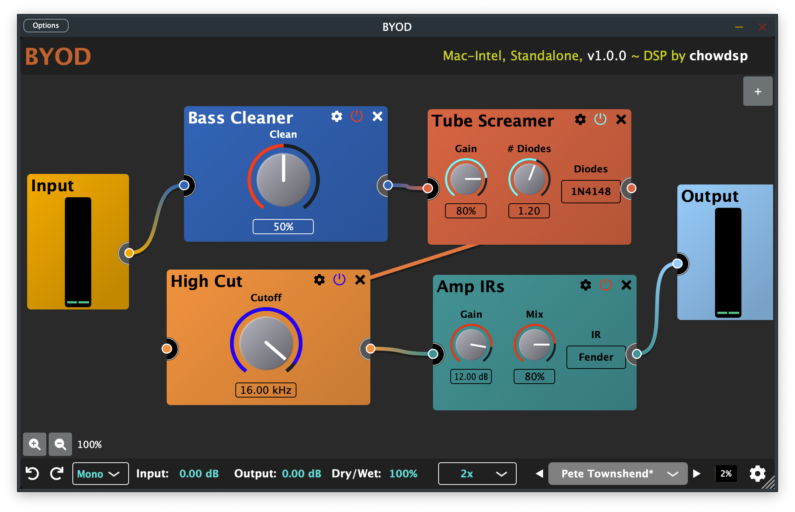

# BYOD (Build-Your-Own Distortion)

[](https://github.com/Chowdhury-DSP/BYOD/releases/latest)

[](https://opensource.org/licenses/GPL-3.0)
[](https://somsubhra.github.io/github-release-stats/?username=Chowdhury-DSP&repository=BYOD&page=1&per_page=30)

BYOD is a guitar distortion plugin with a customisable
signal chain that allows users to create their own guitar
distortion effects. The plugin contains a wide variety
of distortion effects from analog modelled circuits
to purely digital creations, along with some musical
tone-shaping filters, and a handful of other useful
processing blocks.

## Quick Links
- [Latest Release](https://chowdsp.com/products.html#byod)
- [BYOD for iOS](https://apps.apple.com/us/app/byod/id1595313287)
- [Nightly Builds](https://chowdsp.com/nightly.html#byod)
- [User Manual](https://github.com/Chowdhury-DSP/BYOD/blob/main/manual/Manual.md)



BYOD is open to contributions! If you would like to
add new guitar effect processors, please see
[the documentation](./docs).

## Building

To build from scratch, you must have CMake installed.

```bash
# Clone the repository
$ git clone https://github.com/Chowdhury-DSP/BYOD.git
$ cd BYOD

# initialize and set up submodules
$ git submodule update --init --recursive

# build with CMake
$ cmake -Bbuild
$ cmake --build build --parallel 4
```

If you'd like to make an optimized "release" build, it
is suggested to use some slightly different build commands:
```bash
$ cmake -Bbuild -DCMAKE_BUILD_TYPE=Release
$ cmake --build build --config Release --parallel 4
```

BYOD requires CMake version 3.15 or higher, however, BYOD
CLAP builds require CMake 3.21 or higher. CLAP builds can
be disabled by adding `-DBYOD_BUILD_CLAP=OFF` to the first
CMake command.

After a successful build, the resulting plugin binaries will be located in
`build/BYOD_artefacts`.

If building for Linux, please review the Linux dependencies used by
the [BYOD CI pipeline](https://github.com/Chowdhury-DSP/BYOD/blob/main/.github/workflows/cmake.yml#L30).

### Compiling with OpenGL support

By default, OpenGL support is enabled on Windows, and is disabled on all other
platforms.  If you would like to override the default behaviour, you can pass the
argument `-DCHOWDSP_ENABLE_OPENGL=<ON|OFF>` to the CMake configure step.

## Credits:

- Extra Icons - [FontAwesome](https://fontawesome.com/)
- Fuzzy Searching - [fuuzysearch](https://bitbucket.org/j_norberg/fuzzysearchdatabase)
- C++ Utilities:
  - [Magic Enum](https://github.com/Neargye/magic_enum)
  - [Surge Synth Team's cpputils](https://github.com/surge-synthesizer/sst-cpputils)
  - [mpark/variant](https://github.com/mpark/variant)

Credits for the individual processors are shown on
the information page for each processor. Big thanks to all who
have contributed!

## License

BYOD is open source, and is dual-licensed under the 
General Public License Version 3. For more details, 
please see the [licensing documentation](./docs/Licensing.md). Enjoy!
