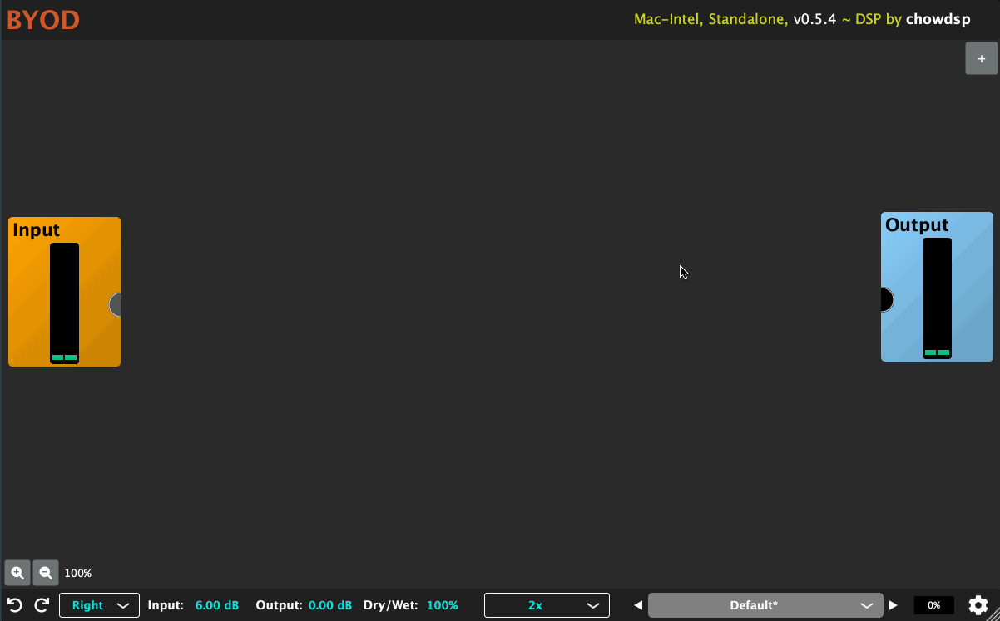
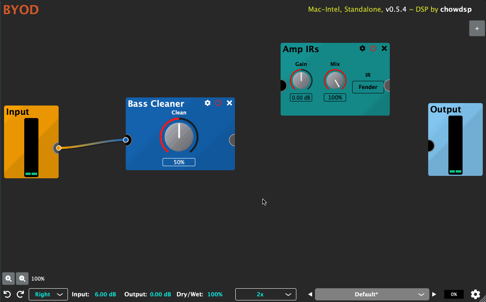
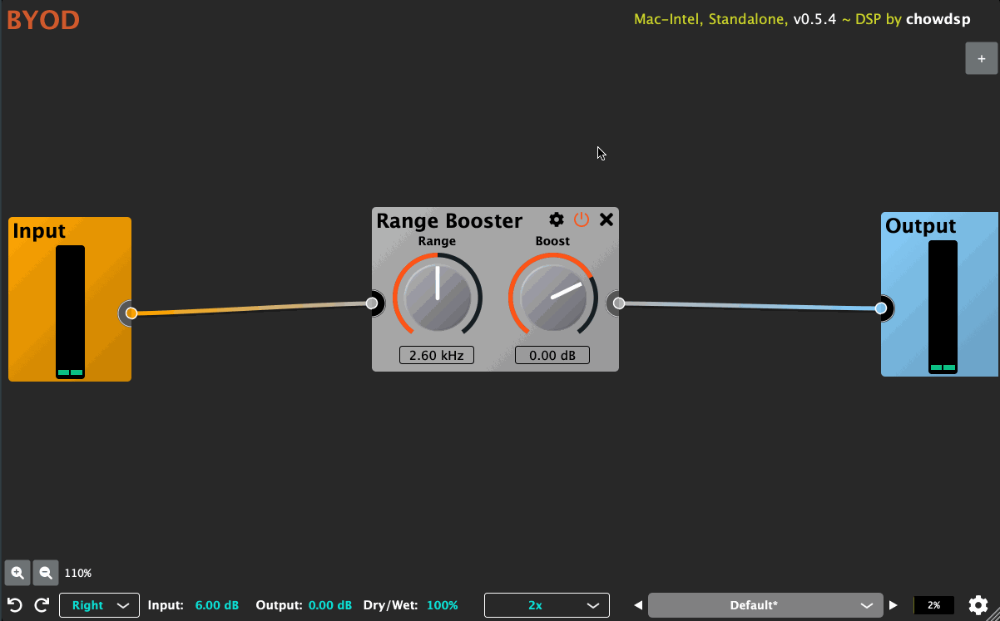

# BYOD User Manual

Build-Your-Own-Distortion (BYOD) is an audio plugin that allows
the user to create custom guitar effects, with a focus on guitar
distortion. The plugin contains emulations of guitar distortion
and tone-shaping circuits from various, along with a handful of
other useful effects. BYOD is currently available for Windows,
Linux, Mac, and iOS in the following formats: VST/VST3, AU, LV2,
AAX, AUv3, and Standalone.

## Installation

To install BYOD for desktop, download the plugin installer
from the ChowDSP website. If you would like to try the latest
changes (potentially unstable), you can download the latest
Nightly build. It is also possible to compile the plugin from
the [source code](https://github.com/Chowdhury-DSP/BYOD). BYOD
for iOS can be downloaded from the [App Store](TODO).

## Getting Started

BYOD is primarly comprised of a "processing chain", made up
of multiple "processors", and "cables" which route signal between
the processors.

### Creating A Processor
To create a new processor, either right-click on the plugin
background, or click on the "plus" icon in the upper right corner.
A menu will appear, offering a selection of processor to be created.

### Removing A Processor
To remove an existing processor, click the "x" button on the top
right of the processor's editor. Note that the "Undo" button can
be used to bring back any previously removed processor.

### Connecting Two Processors
To create a connection between two processors click on an output
port from the first processor, and drag to create a cable. Release
the cable near an input port of the second processor to complete
the connection.

### Destroying A Cable
To destroy a cable, click on the input port at the end of the
connection. Again, the "Undo" button can be used to bring back
any previously destroyed cables.

## Processor Controls

Each processor has an on/off switch, as well as a settings menu,
containing options to reset the processor's parameters, duplicate
the processor, or show the processor information.

## Global Controls

The bottom bar of the plugin (or top bar on iOS) contains several
"global" controls. Note that these controls are not saved when
saving a preset.

### Undo/Redo
The undo/redo controls will undoor redo the following actions:
- Adding/removing/replacing a processor
- Creating/destroying a cables
- Changing a parameter

### Input Mode
Input mode: selects which channel(s) will be used as the input
to the processor chain. In order to save computing resources (CPU),
it is recommended to avoid using "Stereo" mode except when the
input is a stereo signal.

## Input/Output Gain
These controls can be used to affect the gain staging before or
after the processor chain.

### Oversampling
The oversampling menu can be used to control the amount of oversampling
used by the processor chain. There are options for minumum phase
or linear phase oversampling, up to a factor of 16x. There are also
options to use a different oversampling configuration for offline renderring.

### Settings
The "cog" icon on the far right of the global controls opens a "Settings"
menu. Note that the settings provided in this menu are shared across all
instances of the plugin. There are additional options for viewing the plugin
source code, and copying the plugin's diagnostic info.

## Presets

Presets provide a quick way to achieve a specific sound with the
plugin. BYOD comes with a set of built-in factory presets, and contains
several options for sharing presets with other users.

### User Presets
To save the current plugin state as a user preset, open the
presets menu, and select “Save”. The first time a preset is saved,
you will be asked to choose a preset folder. All future presets
will be saved to this folder, and when the plugin opens, it will
search this folder, as well as any subfolders, to load new user
presets.

## Open Source

BYOD is open-source software that is free (as in “free beer”),
and free (as in “free speech”), under the General Public License.
BYOD is open to outside contributors. For more information, see the
relevant documentation on [GitHub](https://github.com/Chowdhury-DSP/BYOD).

## Feedback

Any bug reports and feature requests may be submitted via [GitHub Issues](https://github.com/Chowdhury-DSP/BYOD/issues).
